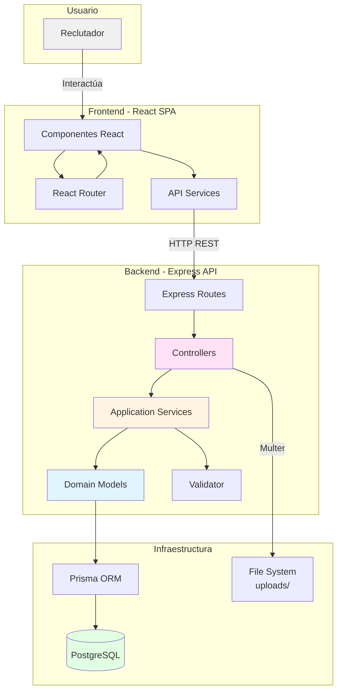
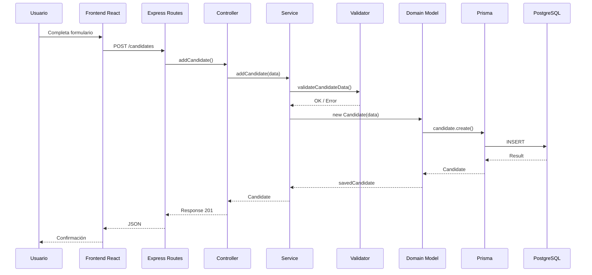
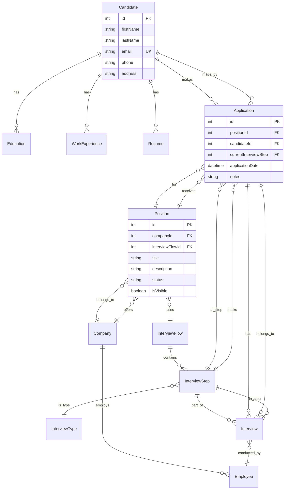
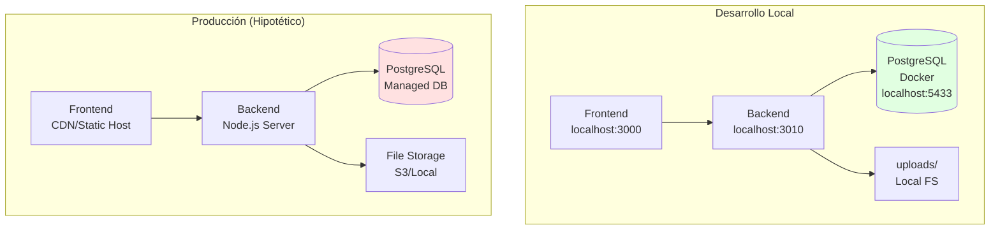
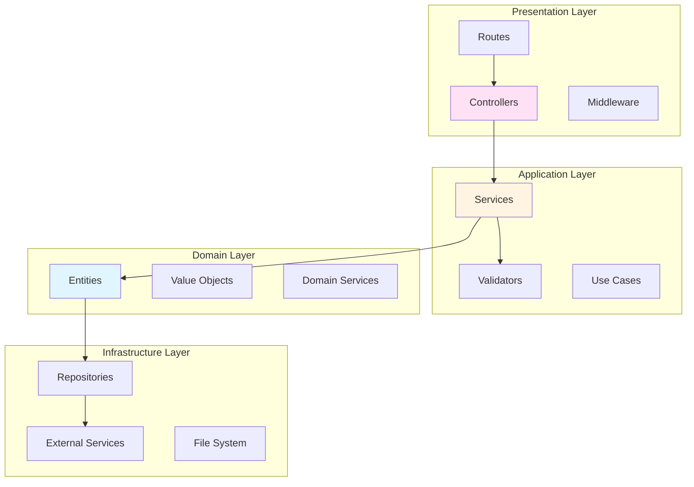

# Architecture Diagrams

## Diagrama de componentes (C4 Level 2)

## Diagrama de flujo de datos (Request Flow)

## Diagrama de modelo de datos (Entity Relationship)

## Diagrama de deployment

## Diagrama de capas DDD

## Limitaciones de los diagramas

1. **Simplificación**: No muestran todos los componentes (middleware, error handlers, etc.)
2. **Estático**: No muestran flujos de error o casos alternativos
3. **Idealizado**: Algunos diagramas muestran arquitectura ideal, no implementación actual
4. **Sin detalles**: No incluyen configuraciones específicas, puertos, etc.

## Notas sobre Mermaid

- Los diagramas usan sintaxis Mermaid estándar
- Compatible con GitHub, GitLab, y muchos editores Markdown
- Pueden renderizarse en VS Code con extensión Mermaid
- Para editar: usar editor online en https://mermaid.live/

## Preguntas al humano

- ¿Hay diagramas adicionales que serían útiles?
- ¿Se requiere documentación de deployment más detallada?
- ¿Hay integraciones externas que deberían aparecer en diagramas?
