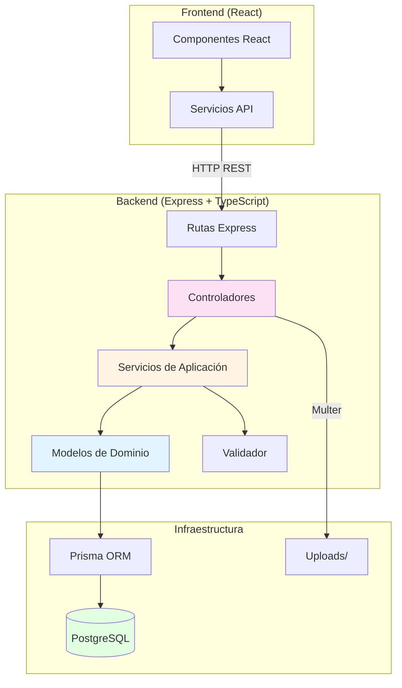

# System Patterns

## 📚 Documentación de referencia

### Backend

**⚠️ IMPORTANTE**: Para trabajo en backend, consulta el documento oficial de Buenas Prácticas:

-   **`memory-bank/backend_best_practices.md`** - Documento completo con arquitectura DDD, Clean Architecture, convenciones, patrones SOLID, ejemplos Before/After y reglas operativas específicas para el backend de este proyecto.

Este documento complementa la información de arquitectura general contenida en este archivo con detalles específicos del backend.

### Frontend

**⚠️ IMPORTANTE**: Para trabajo en frontend, consulta el documento oficial de Buenas Prácticas:

-   **`memory-bank/frontend_best_practices.md`** - Documento completo con arquitectura, convenciones, patrones SOLID, ejemplos Before/After y reglas operativas específicas para el frontend de este proyecto.

Este documento complementa la información de arquitectura general contenida en este archivo con detalles específicos del frontend.

## Arquitectura

**Tipo**: Monorepo con separación frontend/backend

-   **Backend**: Aplicación monolítica con arquitectura en capas siguiendo DDD (Domain-Driven Design)
-   **Frontend**: SPA (Single Page Application) con React
-   **Base de datos**: PostgreSQL (contenedor Docker)
-   **ORM**: Prisma

### Estructura de carpetas

```
/
├── backend/              # Aplicación Express + TypeScript
│   ├── src/
│   │   ├── index.ts      # Entry point del servidor
│   │   ├── domain/       # Capa de dominio (DDD)
│   │   │   └── models/   # Entidades de dominio
│   │   ├── application/  # Capa de aplicación (DDD)
│   │   │   ├── services/ # Servicios de aplicación
│   │   │   └── validator.ts
│   │   ├── infrastructure/ # Capa de infraestructura (DDD)
│   │   ├── presentation/ # Capa de presentación (DDD)
│   │   │   └── controllers/
│   │   └── routes/       # Definición de rutas Express
│   └── prisma/
│       ├── schema.prisma # Esquema de base de datos
│       └── seed.ts       # Datos iniciales
├── frontend/             # Aplicación React
│   ├── src/
│   │   ├── components/   # Componentes React
│   │   ├── services/     # Servicios de API
│   │   ├── config/       # Configuración
│   │   └── App.tsx       # Componente raíz
│   └── build/            # Build de producción
└── docker-compose.yml     # Configuración PostgreSQL
```

## Patrones repetidos en el código

### 1. Domain-Driven Design (DDD)

**Ubicación**: `backend/src/domain/models/`

-   **Entidades de dominio**: Cada modelo (Candidate, Position, etc.) es una clase con lógica de negocio
-   **Métodos de instancia**: `save()`, `findOne()` encapsulan persistencia
-   **Relaciones**: Modelos referencian otros modelos del dominio

**Ejemplo**:

```typescript
// backend/src/domain/models/Candidate.ts
export class Candidate {
    async save() {
        /* lógica de persistencia */
    }
    static async findOne(id: number) {
        /* lógica de búsqueda */
    }
}
```

### 2. Capas de aplicación (DDD)

-   **Domain**: Modelos de negocio puros
-   **Application**: Servicios que orquestan lógica de negocio
-   **Infrastructure**: Acceso a datos (Prisma se usa directamente en domain, pero idealmente debería estar aquí)
-   **Presentation**: Controladores que manejan HTTP

**Flujo típico**:

```
HTTP Request → Route → Controller → Service → Domain Model → Prisma → DB
```

### 3. Validación centralizada

**Ubicación**: `backend/src/application/validator.ts`

-   Validaciones reutilizables con regex patterns
-   Validación de datos antes de crear entidades de dominio
-   Errores descriptivos lanzados como `Error`

### 4. Servicios de aplicación

**Ubicación**: `backend/src/application/services/`

-   Cada servicio maneja una entidad principal (candidateService, positionService)
-   Servicios coordinan entre modelos de dominio
-   Manejo de errores de Prisma (códigos P2002, P2025, etc.)

### 5. Controllers thin

**Ubicación**: `backend/src/presentation/controllers/`

-   Controladores delegan lógica a servicios
-   Manejo de HTTP (status codes, responses)
-   Conversión de errores a respuestas HTTP apropiadas

### 6. Rutas modulares

**Ubicación**: `backend/src/routes/`

-   Cada recurso tiene su archivo de rutas (candidateRoutes, positionRoutes)
-   Rutas importadas en `index.ts` y montadas con prefijo (`/candidates`, `/position`)

## Convenciones de carpetas y naming

### Backend

-   **Archivos TypeScript**: `.ts` (no `.tsx` a menos que use JSX)
-   **Tests**: `*.test.ts` junto al archivo que testea
-   **Naming**:
    -   Clases: PascalCase (`Candidate`, `CandidateService`)
    -   Funciones: camelCase (`addCandidate`, `findCandidateById`)
    -   Archivos: camelCase para servicios/controllers, PascalCase para modelos
-   **Estructura de tests**: Mismo directorio que el código fuente

### Frontend

-   **Componentes**: PascalCase (`RecruiterDashboard`, `AddCandidateForm`)
-   **Archivos de componentes**: PascalCase o camelCase (mezcla detectada)
-   **Servicios**: camelCase (`candidateService.js`)
-   **Config**: camelCase (`api.ts`)

### Base de datos

-   **Modelos Prisma**: PascalCase (`Candidate`, `Position`)
-   **Campos**: camelCase (`firstName`, `currentInterviewStep`)
-   **Relaciones**: Nombres descriptivos (`educations`, `workExperiences`)

## Relaciones entre componentes

### Backend

```
index.ts (Express app)
  ├── Middleware: CORS, JSON parser, Prisma injection
  ├── Routes
  │   ├── candidateRoutes → candidateController
  │   │   └── candidateService → Candidate (domain)
  │   └── positionRoutes → positionController
  │       └── positionService → Position (domain)
  └── /upload → fileUploadService
```

### Frontend

```
App.tsx (Router)
  ├── RecruiterDashboard
  ├── AddCandidateForm
  │   ├── FileUploader
  │   └── candidateService → API
  └── Positions
      └── candidateService → API
```

### Comunicación Frontend-Backend

-   **API Base URL**: Configurada en `frontend/src/config/api.ts`
-   **Endpoints principales**:
    -   `POST /candidates` - Crear candidato
    -   `GET /candidates/:id` - Obtener candidato
    -   `PUT /candidates/:id` - Actualizar etapa
    -   `POST /upload` - Subir CV
    -   `GET /position/:id/candidates` - Candidatos por posición
    -   `GET /position/:id/interviewflow` - Flujo de entrevistas

## Diagrama de arquitectura (Mermaid)



**Limitaciones del diagrama**:

-   No muestra middleware (CORS, JSON parser)
-   No muestra estructura de carpetas DDD completa
-   No muestra tests
-   Simplifica relaciones entre modelos de dominio

## Preguntas al humano

-   ¿Hay planes de migrar Prisma a la capa de infrastructure en lugar de usarlo directamente en domain?
-   ¿Se prefiere mantener tests junto al código o moverlos a carpeta `__tests__`?
-   ¿Hay convenciones de commit messages establecidas?
-   ¿Se usa algún patrón específico para manejo de estado en frontend (Redux, Context API, etc.)?
